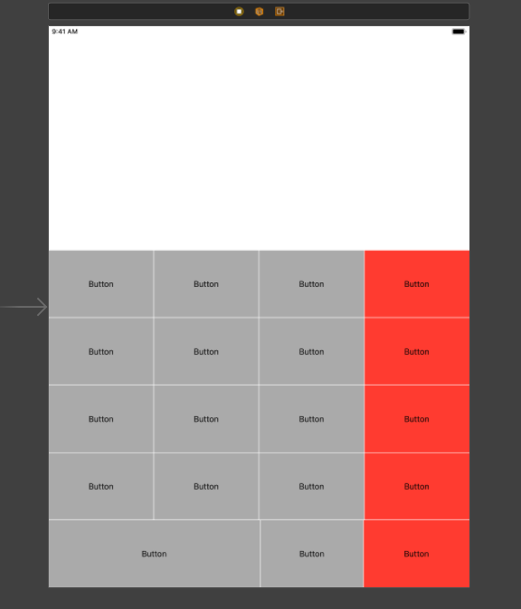

# **Portfolio**

Welcome to my mock portfolio for OSU's Start to Code with Swift course.

Here you will find code snippets and highlights from projects completed in the OSU Start to Code with Swift course.


### **Apple Pie**


The image above highlights a coding assignment that is in the style of a "Hangman" game. When a word is guessed, if a letter is guessed incorrectly an apple falls from the tree until there are no apples left.

This program required the use of creating an instance of a "Struct" to handle the game logic. The code is shown below:

```
struct Game{
    var word: String
    var incorrectMovesRemaining: Int
    var guessedLetters: [Character]
    var formattedWord: String{
        var guessedWord = ""
        for letter in word{
            if guessedLetters.contains(letter){
                guessedWord += "\(letter)"
            }
            else{
                guessedWord += "_"
            }
        }
        return guessedWord
    }

    mutating func playerGuessed(letter: Character){
        guessedLetters.append(letter)
        if !word.contains(letter){
            incorrectMovesRemaining-=1
        }
    }
}
```

### **Calculator**


Above is the beginning of a project to build a calculator. So far, the project has consisted of setting up the UI. The next step would be to set the titles for the labels for the buttons. You could then create a function to use a button's title as a sender for use in calculations. It would look something like:

  ```
  @IBAction func buttonPressed(_ sender: UIButton) {
        let digit = sender.currentTitle
        }
 ```
     

