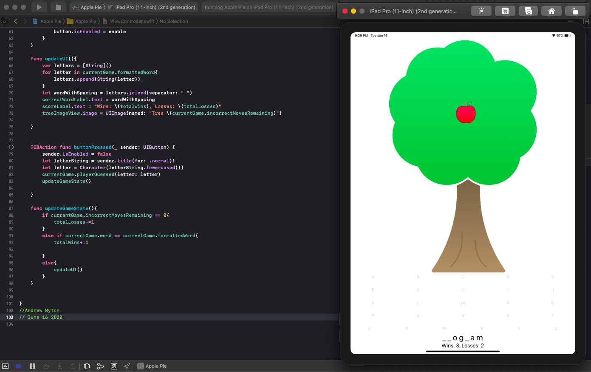

### **Portfolio**

Welcome to my mock portfolio for OSU's Start to Code with Swift course.

Here you will find code snippets and highlights from projects completed in the OSU Start to Code with Swift course.

# **Apple Pie**

The image above highlights a coding assignment that is in the style of a "Hangman" game. When a word is guessed, if a letter is guessed incorrectly an apple falls from the tree until there are no apples left.

This program required the use of creating an instance of a "Struct" to handle the game logic. 
  struct Game{
      var word: String
     var incorrectMovesRemaining: Int
     var guessedLetters: [Character]
     var formattedWord: String{
          var guessedWord = ""
          for letter in word{
              if guessedLetters.contains(letter){
                guessedWord += "\(letter)"
             }
             else{
                  guessedWord += "_"
              }
          }
         return guessedWord
     }

    mutating func playerGuessed(letter: Character){
        guessedLetters.append(letter)
        if !word.contains(letter){
            incorrectMovesRemaining-=1
        }
    }
}
